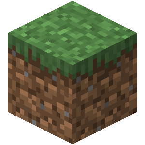

## **Ejemplo MarkDown**
## **Practica 1:**

---
## **Headings**
---
# H1
    # H1
## H2
    ## H2
### H3
    ### H3
#### H4
    #### H4
##### H5
    ##### H5
###### H6
    ###### H6
___

## **Enfasis**
___
### Texto en negrita:
    **Texto en negrita**
    __Texto en negrita__
#### **Texto en negrita**

#### __Texto en negrita__
___
### Texto en italic:
    *Texto en italic*
    _Texto en italic_
#### *Texto en italic*

#### _Texto en italic_
___
### Texto en negrita y italic:
    ***Texto en negrita y italic***
    ___Texto en negrita y italic___
#### ***Texto en negrita y italic***

#### ___Texto en negrita y italic___
---
## **Bloques**
---
    >Primer bloque
    >>Segundo bloque
    >>>Tercer bloque
    >>>>Cuarto bloque
>Primer bloque
>>Segundo bloque
>>>Tercer bloque
>>>>Cuarto bloque
---
## **Listas**
---
### Listas desordenadas:
    + Esto es una lista.
    - Esto es una lista.
    * Esto es una lista.
        * Esto es una sublista.
            + Esto es una sublista.
                - Esto es una sublista.
+ Esto es una lista.
- Esto es una lista.
* Esto es una lista.
    * Esto es una sublista.
        + Esto es una sublista.
            - Esto es una sublista.
---
### Listas ordenadas:
    1. Primero en la lista.
    2. Segundo en la lista.
    3. Tercero en la lista.
    4. Cuarto en la lista.
1. Primero en la lista.
2. Segundo en la lista.
3. Tercero en la lista.
4. Cuarto en la lista.
---
## **Meter código**
---
### Entre lineas:
    Por ejemplo `or`,`not` and `and`.
#### Por ejemplo `or`, `not` and `and`.
---
### A parte:
    //Para meter codigo a parte tenemos que darle una vez al tabulador.
        ###Por ejemplo esto de aquí.
    //O tambien puedes usar el triple acento.
        ```
        Por ejemplo esto de aquí.
        ```
---
### Sobre otros lenguajes:
#### Simplemente agregamos la nomenclatura del lenguaje en concreto.
    ``` js
        var foo = function (bar) {
            return bar++;
        };

        console.log(foo(5));
    ```
``` js
var foo = function (bar) {
  return bar++;
};

console.log(foo(5));
```
---
## **Tablas**
---
### Contenido de una tabla:
#### En una tabla tenemos lineas y columnas:
+ Para las lineas tenemos que poner doble bara vertical`| Texto |`.
+ Para las columnas hay que definir la cantidad de barras verticales que tendra nuestra tabla `| 1 | 2 | 3 | 4 | 5 |`.
+ Aunque para que la tabla se represente hay que definir los títulos de la tabla con la cantidad de guiones necesarias según la cantidad de letras que contenga la palabra `| --- |`.
#### Ejemplo:
    | Uno | Dos | Tres |
    | --- | --- | ---- |
    | El número 1. | El número 2. | El número 3. |
| Uno | Dos | Tres |
| --- | --- | ---- |
| El número 1. | El número 2. | El número 3. |

+ Si queremos que los títulos esten ubicados en la derecha o la izquierda hay que poner dos puntos en los guiones `| ----: |`
#### Ejemplo:
    | Uno | Dos | Tres |
    | :--- | ---: | ----: |
    | El número 1. | El número 2. | El número 3. |
| Uno | Dos | Tres |
| :--- | ---: | ----: |
| El número 1. | El número 2. | El número 3. |
---
## **Links**
---
### Links en texto:
    [Youtube](https://www.youtube.com/)
#### [Youtube](https://www.youtube.com/)
---
### Links en texto con título:
    [Google](https://www.youtube.com/ "Google")
#### [Google](https://www.google.es/ "Google")
---
### Links visibles en texto:
    Esto es un link: https://www.amazon.es
#### Esto es un link: https://www.amazon.es
---
## **Imagenes**
---
### Imagen normal:
    

---
### Imagen con título:
    

---
### ***Marc Albert Seguí Olmos***
